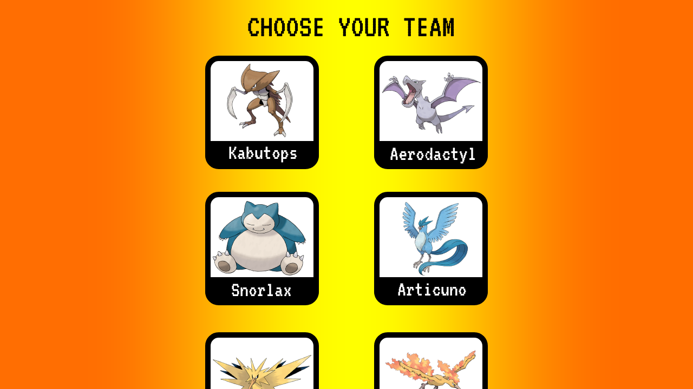
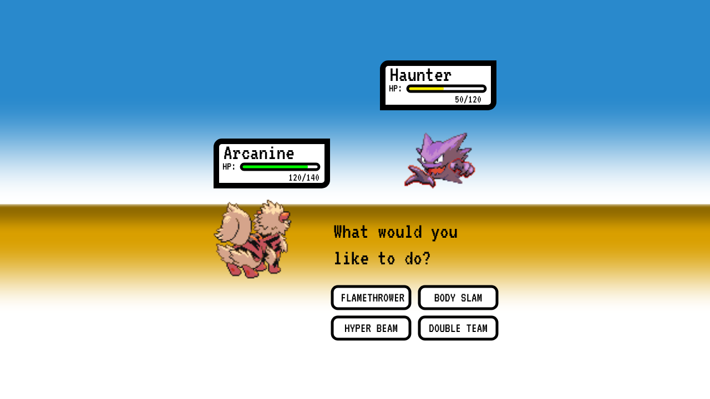

# Great Value Pokémon Stadium
Startup application for BYU CS 260

## Specification Deliverable

### Elevator pitch
Have you ever wished that Pokémon were real? Have you ever thought: "*oh man, I really want to own and control fantastical, powerful creatures and make them fight each other*"? That's a little messed up, but if that's what you're into, then I have four words for you: **Great. Value. Pokémon. Stadium.** This web application will allow you to select a team of Pokémon, join a lobby, see the list of moves available to the Pokémon you chose, and battle your friends' teams. As the user selects a move, the opponent will be notified and the calculated damage will be applied in real time. If you manage to defeat all of your opponent's Pokémons, you win!

### Design
After successful login, the user will see a list of Pokémon to select for their team:

Once a team is selected and another player has joined the lobby, the battle page will be displayed:

### Key features
- Secure login using HTTPS.
- Display of a list of Pokémon, with their respective names and pictures.
- Ability to select a team of six Pokémon.
- Ability to join a lobby to fight another player.
- Display of the user's selected Pokémon and the opponent's Pokémon images when battling, with their respective HP.
- Ability to choose from a list of available Pokémon moves to attack the opponent.
- Real time notification of move selection, damage inflicted, and winner of the battle.
- Display of a stats table, with usernames and number of battles won and lost.
- Storage of user data and stats in a database for persistence.

### Technologies
- **HTML:** It will provide the structure for the web application, which will have a minimum of four HTML pages: the login page, the page that displays the list of Pokémon, the battle page, and the stats page.
- **CSS:** It will ensure that the application has the correct style and renders visual elements properly, with the correct color selection.
- **JavaScript:** It will handle client-side code, like input validation, team selection, move selection, and web service calls to the backend.
- **Service:** It will provide endpoints so the client can make calls to execute the following actions:
    - Register
    - Log in
    - Save team
    - Make move
    - Retrieve stats
- **Authentication:** It will allow users to register and log in to the application. Authentication will be required to be able to choose a team and battle.
- **Database:** It will securely store the user credentials, team selection, and number of battles won and lost.
- **WebSocket:** It will provide real time notifications to the users about moves selected, damage inflicted, and game winner.
- **React:** It will provide the framework that will enable users to interact with the web application.

## HTML Deliverable
For this deliverable, I built the main HTML structure for my application.
- **HTML:** Added four HTML pages to provide the ability to log in, select a team of Pokémon, battle with an opponent, and see the leaderboard.
- **Links:** The login page links to the team selection, which in turn links to the battle page, and from there the user can go to the leaderboards page. There is also a link back to the team selection page from the leaderboards.
- **Text:** The names of the Pokémon, the move selections, and other elements are represented with text.
- **Images:** There are images of the different Pokémon in the team selection page and in the battle page.
- **Authentication:** There is a form and a submit button in the login page that allows the user to enter their username and password to authenticate.
- **Database:** The leaderboards page contains a table of usernames and battle statistics that will be stored and pulled from the database.
- **WebSocket:** The battle page will provide real time WebSocket notifications when an opponent joins the battle and when they choose a move to attack.

## CSS Deliverable
To complete this deliverable, I used CSS to style the application into its final appearance.
- **Header, footer, and main content body:** I used CSS flexbox and the Bootstrap framework to style the header, footer, and the main elements of all the pages.
- **Navigation elements:** The navigation elements are now in a navigation bar on the header of all pages, and the one corresponding to the current page is a different color than the rest.
- **Responsive to window resizing:** The web app maintains its style and format when resizing the window, and adjusts the position of some elements when necessary.
- **Application elements:** The spacing between application elements is appropriate, the colors are easy on the eyes, and there is good contrast.
- **Application text content:** The fonts are easy to read, with appropriate sizing and color, and are consistent with the theme of the application.
- **Application images:** There are images embedded in Bootstrap containers, which were styled with a darker background color, a solid border, and a corner radius to give it the appearance of a card.

## JavaScript Deliverable
For this deliverable, I added JavaScript functionality that modifies the HTML content to mock its intended behavior when it is completed.
- **Login:** Pressing the "Log in" button validates the credentials entered against a mock database of credentials. If the "Register as a new user" checkbox is selected, the credentials get added to the "database". On succesful validation, it takes you to the Pokémon selection page.
- **Database:** There are JavaScript objects that represent the credentials and leaderboards tables. Those are currently being updated by the code and will be replaced with a real database later.
- **WebSocket:** A SetTimeout function is running after the user selects a move, emulating the opponent attacking back. This will be replaced with real WebSocket data later.
- **Application logic:** The Pokémon selected is highlighted on click, and that selection is persisted via localstorage when going to the battle page. The move are highlighted on hover, and clicking one of them sends an "attack" to the opponent. 

## Service Deliverable
For this deliverable, I added JavaScript functionality that modifies the HTML content to mock its intended behavior when it is completed.
- **Node.js/Express HTTP service:** Done -- created the HTTP service using Node and Express.
- **Static middleware for frontend:** Done -- it's being served by Express.
- **Calls to third party service:** Done -- my application is calling the [PokeApi](https://pokeapi.co/) service to retrieve Pokémon data.
- **Backend service:** Done -- created GET and POST endpoints to retrieve and update the leaderboard.
- **Frontend calls to service endpoints:** Done -- the battle and leaderboard frontend pages call the backend service endpoints using the fetch function.

## Notes
[Link to notes](notes.md)
