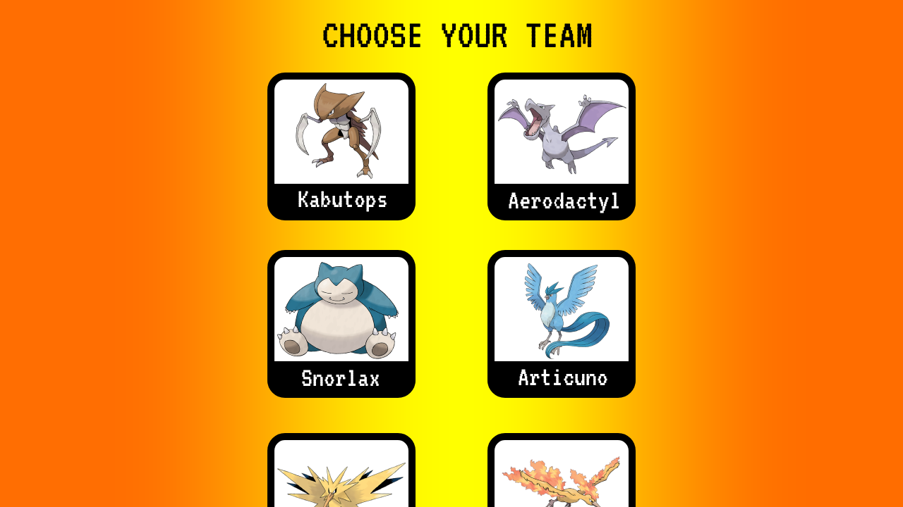
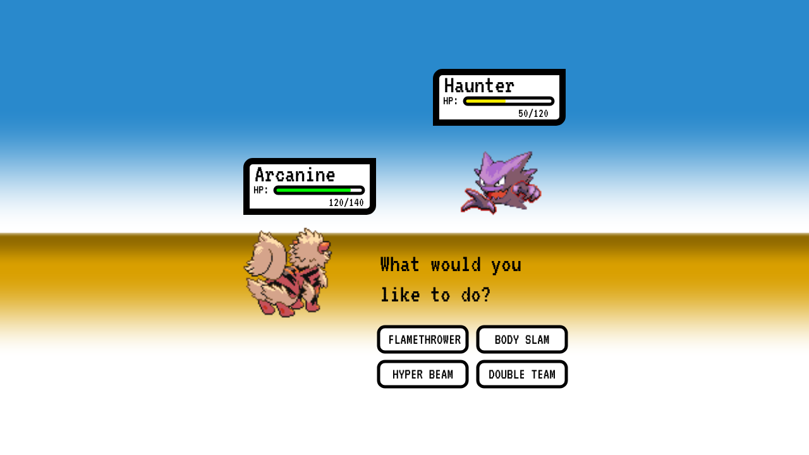

# Great Value Pokémon Stadium
Startup application for BYU CS 260

## Specification Deliverable

### Elevator pitch
Have you ever wished that Pokémon were real? Have you ever thought: "*oh man, I really want to own and control fantastical, powerful creatures and make them fight each other*"? That's a little messed up, but if that's what you're into, then I have four words for you: **Great. Value. Pokémon. Stadium.** This web application will allow you to select a team of Pokémon, join a lobby, see the list of moves available to the Pokémon you chose, and battle your friends' teams. As the user selects a move, the opponent will be notified and the calculated damage will be applied in real time. If you manage to defeat all of your opponent's Pokémons, you win!

### Design
After successful login, the user will see a list of Pokémon to select for their team:

Once a team is selected and another player has joined the lobby, the battle page will be displayed:

### Key features
- Secure login using HTTPS.
- Display of a list of Pokémon, with their respective names and pictures.
- Ability to select a team of six Pokémon.
- Ability to join a lobby to fight another player.
- Display of the user's selected Pokémon and the opponent's Pokémon images when battling, with their respective HP.
- Ability to choose from a list of available Pokémon moves to attack the opponent.
- Real time notification of move selection, damage inflicted, and winner of the battle.
- Display of a stats table, with usernames and number of battles won and lost.
- Storage of user data and stats in a database for persistence.

### Technologies
- **HTML:** It will provide the structure for the web application, which will have a minimum of four HTML pages: the login page, the page that displays the list of Pokémon, the battle page, and the stats page.
- **CSS:** It will ensure that the application has the correct style and renders visual elements properly, with the correct color selection.
- **JavaScript:** It will handle client-side code, like input validation, team selection, move selection, and web service calls to the backend.
- **Service:** It will provide endpoints so the client can make calls to execute the following actions:
    - Register
    - Log in
    - Save team
    - Make move
    - Retrieve stats
- **Authentication:** It will allow users to register and log in to the application. Authentication will be required to be able to choose a team and battle.
- **Database:** It will securely store the user credentials, team selection, and number of battles won and lost.
- **WebSocket:** It will provide real time notifications to the users about moves selected, damage inflicted, and game winner.
- **React:** It will provide the framework that will enable users to interact with the web application.

## Notes
[Link to notes](notes.md)
